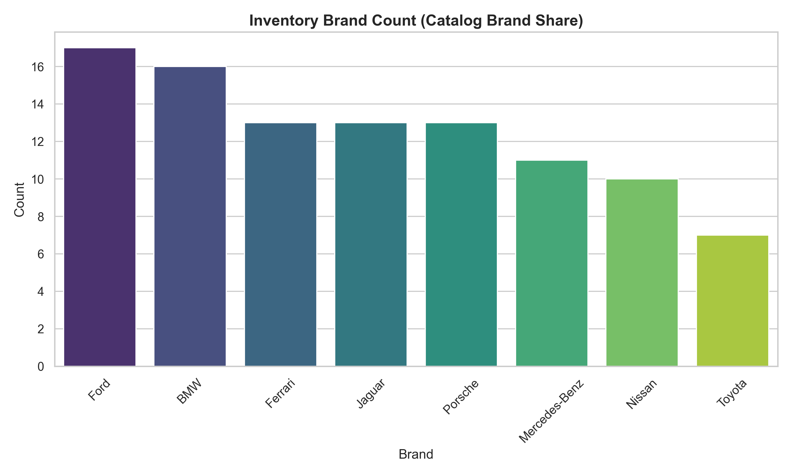
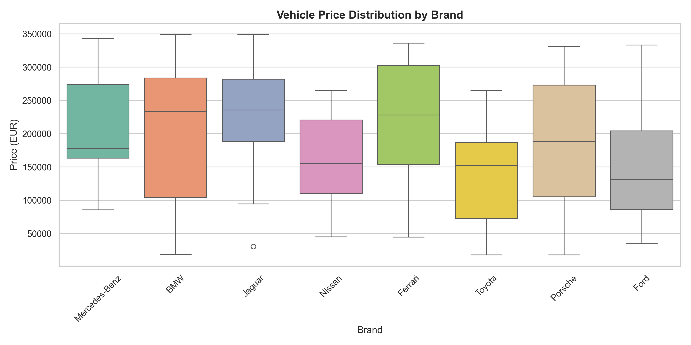
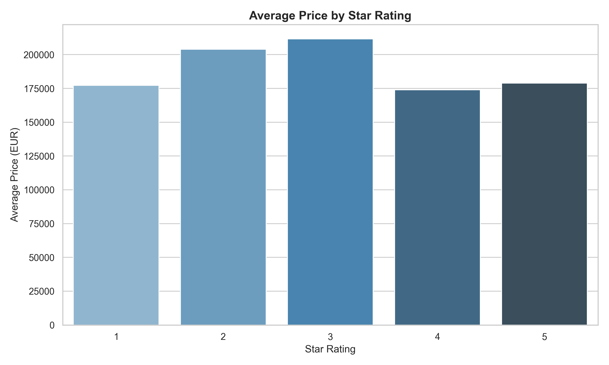
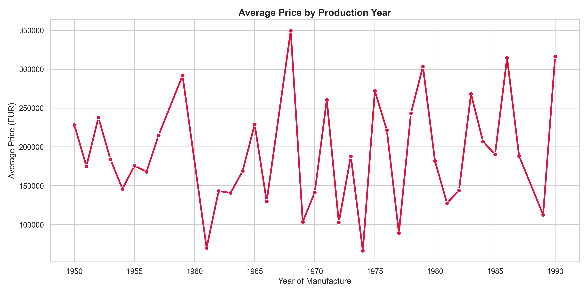
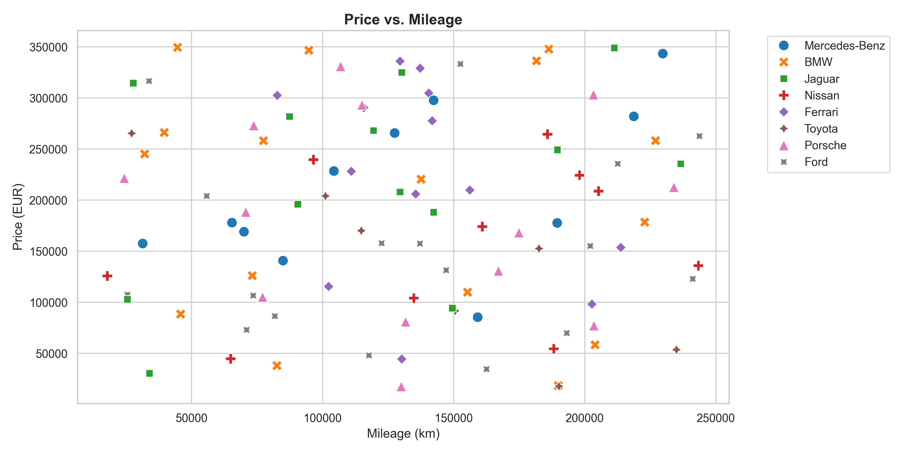
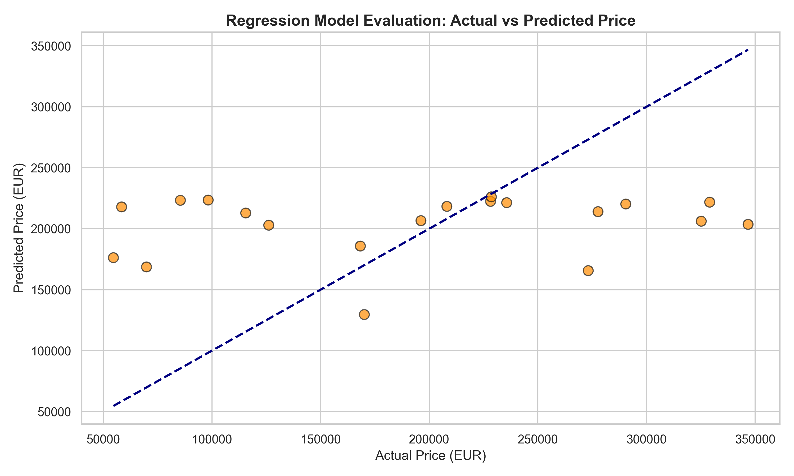

# 🚗 Vintage Vehicle Price Monitor & Trend Predictor

An end-to-end Python web scraping, data simulation, and Machine Learning pipeline.


---

## 📌 Project Overview

This repository hosts a production-grade machine learning project that scrapes classic vehicle listings, structures the scraped details, simulates a 90-day time-series database to model market trend dynamics, and constructs a predictive forecasting model. Using robust feature engineering and regression modeling, the pipeline predicts the next-day valuation of listed vehicles, offering valuable insights into vehicle pricing volatility.

---

## ⚙️ Core Technical Features

*   **Dynamic Web Scraping:** Multi-page dynamic pagination crawler leveraging **BeautifulSoup** and **Requests** to scrape dynamic listings (Title, Price, Year, Rating, Mileage, and Availability) from an e-commerce sandbox test site.
*   **Time-Series Data Simulation:** Extends static crawled records by generating **90 days of synthetic daily historical price fluctuations**, introducing seasonal variations, weekend pricing trends, and simulated promotional discounts.
*   **Feature Engineering Engine:** Computes rolling window averages, historical price standard deviations, and multi-period lag variables to construct predictive variables.
*   **No-Leakage ML Modeling:** Implements a strict chronological Train/Test split structure to prevent future-data leakage, training a **Scikit-Learn Linear Regression** model for next-day price predictions.
*   **Robust Diagnostic Visualizations:** Generates a full suite of descriptive and evaluative visual assets mapping inventory market share, depreciation curves, and forecasting errors.

---

## 🗺️ Pipeline Workflow

```
       [Dynamic Web Scraping]
                  │  (Requests & BeautifulSoup4 extraction)
                  ▼
    [Data Cleaning & Simulation]
                  │  (Type-casting, text extraction, & 90-day simulation)
                  ▼
       [Storage Persistence]
                  │  (PostgreSQL relational database / CSV fallback)
                  ▼
       [Feature Engineering]
                  │  (Rolling statistics & lag feature computations)
                  ▼
        [Temporal ML Modeling]
                  │  (Chronological Train-Test Split (No Leakage))
                  ▼
     [Model Evaluation & Dashboard]
                     (Metrics compilation & Seaborn plot exports)
```

---

## 📁 Repository Architecture

```
├── data/
│   └── scraped_cars.csv            # Extracted & simulated vehicle time-series dataset
├── plots/
│   ├── actual_vs_predicted.png     # Model forecasting vs actual valuation plot
│   ├── brand_share.png             # Market count share per brand
│   ├── price_by_brand.png          # Boxplot of prices distribution per brand
│   ├── price_by_rating.png         # Vehicle quality rating vs listing price
│   ├── price_by_year.png           # Listing year vs price progression curves
│   └── price_vs_mileage.png        # Mileage decay impact on listing prices
├── scraper.py                      # Multi-page BeautifulSoup web scraper crawler
├── analysis.ipynb                  # Data simulation, DB export, feature engineering & ML notebook
├── requirements.txt                # Python package dependency manifests
└── README.md                       # Repository documentation
```

---

## 🚀 Installation & Quick Start

### 1. Clone & Set Up Environment
```bash
git clone https://github.com/SrushtiKumar/E-Commerce-Price-Monitor-Trend-Predictor.git
cd E-Commerce-Price-Monitor-Trend-Predictor
pip install -r requirements.txt
```

### 2. Run the Scraper
Execute the data crawler to fetch raw listings and save them to `data/`:
```bash
python scraper.py
```

### 3. Run the ML Pipeline
Run the database export, feature engineering, modeling, and evaluation notebook:
```bash
jupyter nbconvert --to notebook --execute analysis.ipynb
```

---

## 📊 Model Evaluation Metrics

| Metric | Target Value | Description |
|:---|:---|:---|
| **Mean Absolute Error (MAE)** | `EUR 76,439.50` | The average magnitude of absolute forecasting errors. |
| **Root Mean Squared Error (RMSE)** | `EUR 91,961.14` | The average prediction deviation, penalizing outliers. |
| **R-squared ($R^2$ Score)** | `0.0151` | Proportion of target variance explained by predictive model features. |

---

## 🖼️ Visualizations Gallery

All diagnostic plots are automatically saved to `plots/` and are displayed below:

<table>
  <tr>
    <td><br/><b>Brand Market Share</b></td>
    <td><br/><b>Price by Brand</b></td>
  </tr>
  <tr>
    <td><br/><b>Price by Rating</b></td>
    <td><br/><b>Price by Year Trend</b></td>
  </tr>
  <tr>
    <td><br/><b>Price vs Mileage</b></td>
    <td><br/><b>Actual vs Predicted</b></td>
  </tr>
</table>
